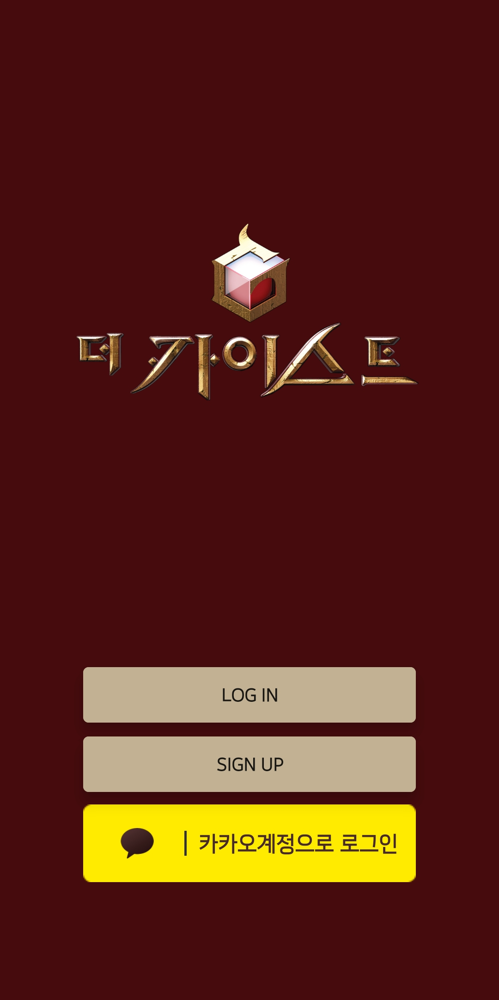
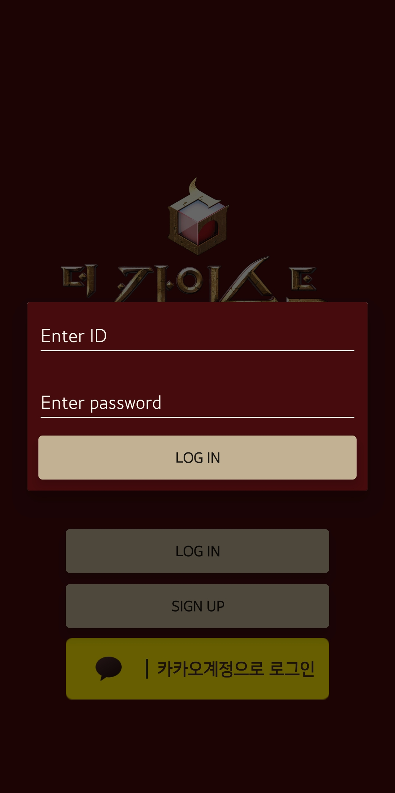
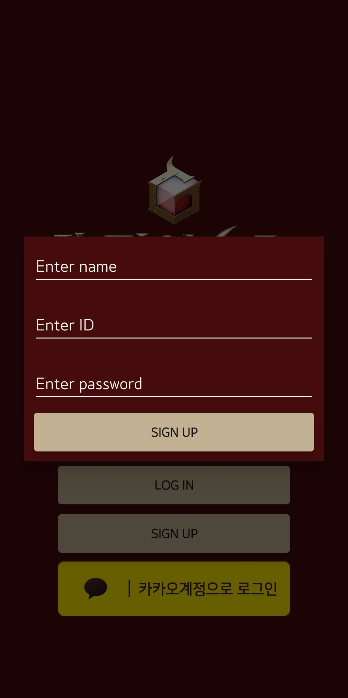
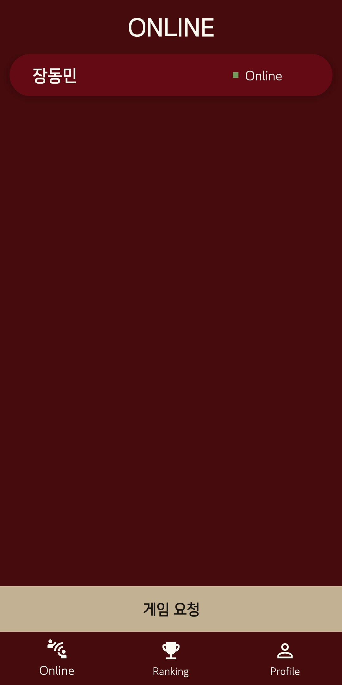
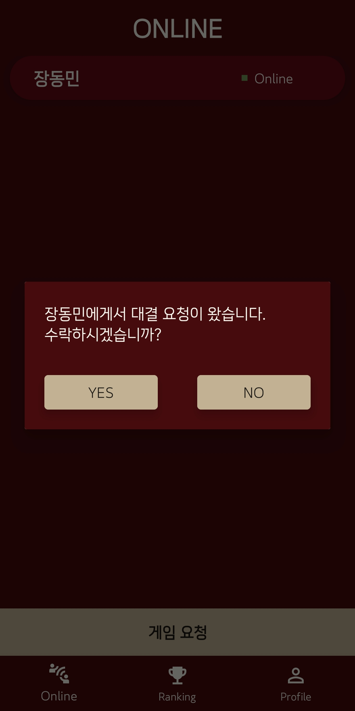
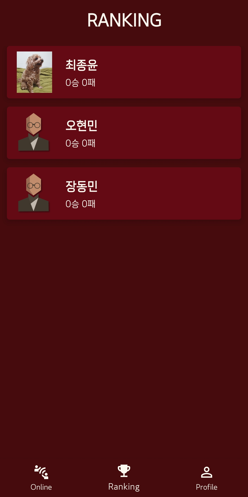
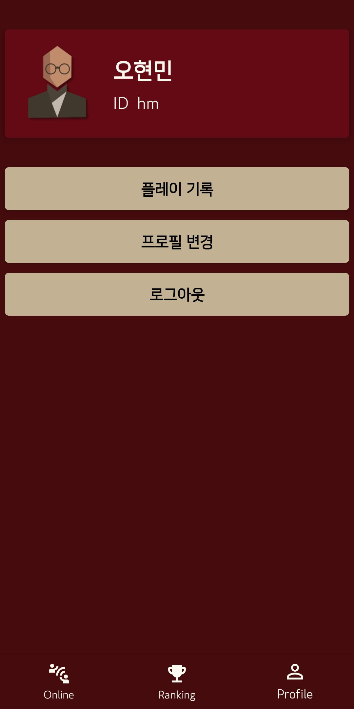
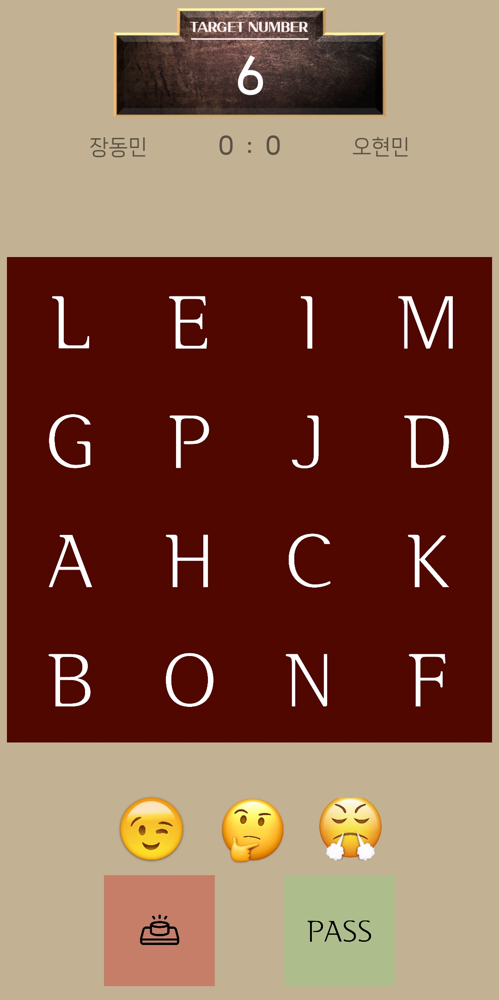

# TheKAIST

더 지니어스의 <같은 숫자 찾기> 게임을 멀티 플레이 가능한 모바일 앱 게임으로 구현했다.

> 개발자: 송재현, 최종윤

## Login

  

+ LOG IN 버튼을 통해 회원가입 한 계정으로 접속할 수 있다.
+ SIGN UP 버튼을 통해 회원가입 할 수 있다.
+ 카카오 로그인 버튼을 통해 카카오 계정으로 회원가입/로그인 할 수 있다.

## Main

   

+ Online 탭
  + 실시간 접속자들을 확인할 수 있다. 다른 유저와 게임을 하고있는 사람이라면 Playing 상태로 표시가 되고, 만약 아니라면 Online이라고 표시가 된다.
  </b> 함께 게임할 상대를 클릭하면, 클릭한 상대에게 게임을 요청할 수 있다. 요청을 받은 상대방 화면에 요청 수락/거절 알림창이 나타난다. 취소 시 메인으로 돌아가고, 수락 시 게임이 시작된다.
+ Ranking 탭
  + 게임의 전체 회원의 순위가 보여지게 된다. 각 유저의 승리 횟수가 높은 순서대로 정렬되어, 사용자의 프로필과 이름, 승패의 횟수가 보여진다.
+ Profile 탭
  + 본인의 프로필을 확인할 수 있다. 이름과 아이디, 프로필 사진이 보여지고 아래에 순서대로 세개의 버튼이 있다.
    1. 플레이 기록을 클릭하면 본인의 지금까지의 게임 기록이 보여진다. 어떤 상대와 게임을 해서 이겼는지 졌는지를 알 수 있고, 각각 몇점 씩 얻었는지 확인할 수 있다.
    2. 프로필 변경으로 들어간다면 본인의 이름과 비밀번호, 프로필 사진을 변경할 수 있다. 프로필 사진은 총 네 개가 기본으로 내장되어 있어 이 중에 한개를 골라 사용할 수 있다. 카카오 로그인을 한 경우, 카카오 프로필로 처음 기록되고 게임 사진으로 수정한다면 카카오 프로필사진과 다른 사진으로 변경된다. 또한 비밀번호 정보는 받아오지 않기때문에 수정에 영향을 끼치지 않는다.
    3. 로그아웃을 클릭한다면, 현재 로그인 된 계정이 로그아웃되면서 다른 유저의 Online 탭에서 Online 상태였던 본인의 정보가 사라진다.

## Game

  

+ 게임 화면 구성
  1. 맨 위에는 게임할 때 목표가 되는 타겟 숫자가 보여진다. 게임이 처음 연결될 때는 Wait, 10초간 뒷면의 숫자와 연산자를 보여줄 때에는 Show for 10 seconds, 이후 게임이 시작할 때 Game start 가 보였다가 타겟 숫자가 나타나게 된다.
  2. 그 아래에는 현재 함께 게임하는 상대방과 본인의 획득 점수(이긴 라운드 횟수)가 보여진다. 5점을 먼저 맞추면 게임이 종료된다.
  3. 화면 중앙에는 게임카드 16장이 보여진다. 카드의 앞면은 랜덤으로 정해진 알파벳, 뒷면은 숫자나 연산자로 이루어져 있다. 게임을 진행하면서 본인의 차례에는 세개의 카드를 클릭할 수 있고, 클릭하면 본인의 화면과 상대방의 화면에서 클릭된 카드가 뒤집히면서 숫자와 연산자를 확인할 수 있다.
  4. 아래에는 세 개의 이모지가 있다. 함께 게임하고 있는 상대에게 실시간으로 보낼 수 있는 이모지 메시지이다. 하나씩 클릭을 하면 상대방의 게임카드 위쪽에 본인이 보낸 이모지가 나타난다.
  5. 화면 밑에는 버저 버튼과 pass 버튼이 있다. 게임을 하면서 본인이 카드를 뒤집고 싶을 때에 먼저 버저 버튼을 눌러 차례를 얻어야 한다. 만약 pass 버튼을 누른다면 본인은 해당 라운드를 기권하고 다음 라운드로 넘어가기를 희망하는 것이다. 본인이 pass를 요청하면 상대방의 화면에 pass를 하실 것인지 요청하는 알림창이 나타나고, 수락하면 다음 라운드로 넘어간다. 상대방이 거절한다면 상대방에게 한번의 기회가 주어지고 다음 라운드로 넘어간다.

+ 게임 방법
  1. 게임 요청을 수락하면, 게임이 시작되면서 게임화면이 실행된다.
  2. 서로에게 뒷면의 숫자와 연산자가 10초간 보여지는데, 1~12의 숫자와 사칙연산자의 위치를 빠르게 확인하고 기억해야한다.
  3. 10초 뒤 카드가 뒤집어지고 타겟 숫자가 나타나게 된다. 이제부터 타겟 숫자를 숫자 카드, 연산자 카드, 다른 숫자 카드 세개로 만들어내는 것이 목표이다. 본인이 먼저 기회를 얻고싶다면 버저버튼을 먼저 누르면된다. 그럼 상대방의 버저 버튼은 눌리지 않게되고, 본인의 차례가 되어 카드를 클릭할 수 있다. 만약 틀리면 차례가 상대방에게로 넘어가면서 상대방의 버저버튼이 클릭 가능하게 된다. 차례는 이렇게 매 라운드마다 번갈아가면서 진행한다.
  4. 세 개의 카드를 눌러 확인하고, 만약 맞다면 점수가 올라가면서 다음 라운드로 넘어가 새로운 타겟 숫자를 받는다. 차례는 또 먼저 버저 버튼을 누른사람이 먼저 가져간다.
  5. 타겟 숫자를 패스하고 싶은 경우, 패스 버튼을 누른다. 누르게 되면 상대방에게 패스를 할 지 요청하는 알림창이 뜨고, 수락하면 타겟 숫자가 바뀐다. 거절하면 상대방에게는 한번의 기회만이 주어지고 다음 라운드로 넘어가게된다.
  6. 5점을 얻는 사람이 이기고, 게임이 종료된다.
  7. 게임을 하면서 상대방과 이모지 사진을 통해 소통할 수 있다.

## Implementation
+ MongoDB를 이용해 useraccount와 battle 두 개의 schema를 만들어 이용했다. 가입된 useraccount에서는 사용자의 id, 이름, 비밀번호, 프로필 이미지, 이긴 횟수, 진 횟수를 저장한다. battle에서는 게임아이디, 요청자의 id(ask), 수락자의 id(accept), 요청자의 점수 ask_scr, 수락자의 점수 accept_acr, 승자의 이름, 패배자의 이름이 기록된다.
